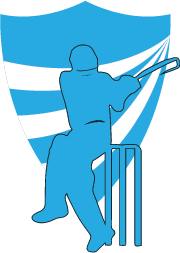

<p align="center"></p>
<h1 align="center">IIITV Cricket League :cricket:</h1>

<h4 align="center"> Website for CricLeague powered by
 &
</h4>

### Development 🔧

#### Install dependencies

```sh
npm i
```

#### Start the app

```sh
npm start
```

### Authors ✍️

©️ [Shubham Singh](https://github.com/singhshubham98/IIITVCricLeague) ✨

[](https://app.netlify.com/sites/singhshubham98/deploys)

<hr>
<p align="center">
 <a href="/LICENSE">
    
</a>
</p>
